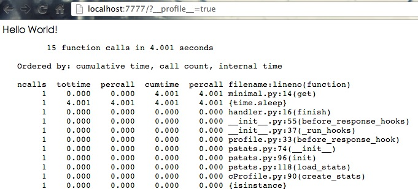
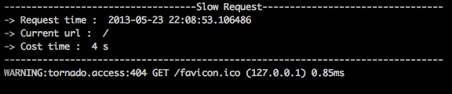

TMiddleware
==================

middleware for tornado

##Installation

    git clone git@github.com:iamsk/tmiddleware.git
    cd tmiddleware
    python setup.py install

##Requirements

* python 2.6 or 2.7
* tornado

##Minimal Demo

###$ more examples/miminal.py

    import tornado
    import tornado.httpserver
    from tornado.options import define, options
    from tornado.web import RequestHandler
    
    from tmiddleware.handler import TMiddlewareHandler
    
    define('port', 7777)
    MIDDLEWARES = ['plugins.slow_request.SlowRequestMiddleware', 'plugins.profile.ProfileMiddleware']
    define("middlewares", default=MIDDLEWARES, help="middleware class list")
    
    
    class With(TMiddlewareHandler):
        def get(self):
            import time
            time.sleep(4)
            return self.finish('Hello World!')
    
    
    def run():
        application = tornado.web.Application([('/', With)])
        http_server = tornado.httpserver.HTTPServer(application, xheaders=True)
        http_server.listen(options.port, '0.0.0.0')
        tornado.ioloop.IOLoop.instance().start()
    
    if __name__ == '__main__':
        run()

此处使用了自带的两个 middleware，一个用于查看请求的 profile 信息，一个用于在终端下记录超时的请求

###$ python miminal.py

###$ chrome http://localhost:7777/?__profile__=true

web:

console:

##Plugins

自带了两个：

1. profile: 查看请求的内部函数耗时信息
2. slow_request: 记录超时请求

自定义插件参考这两个即可